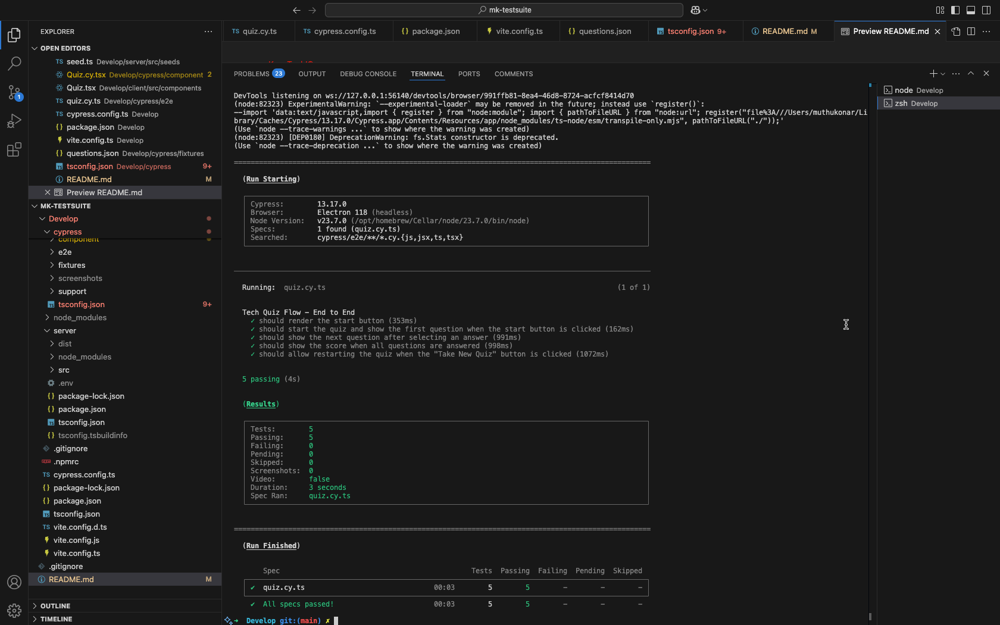
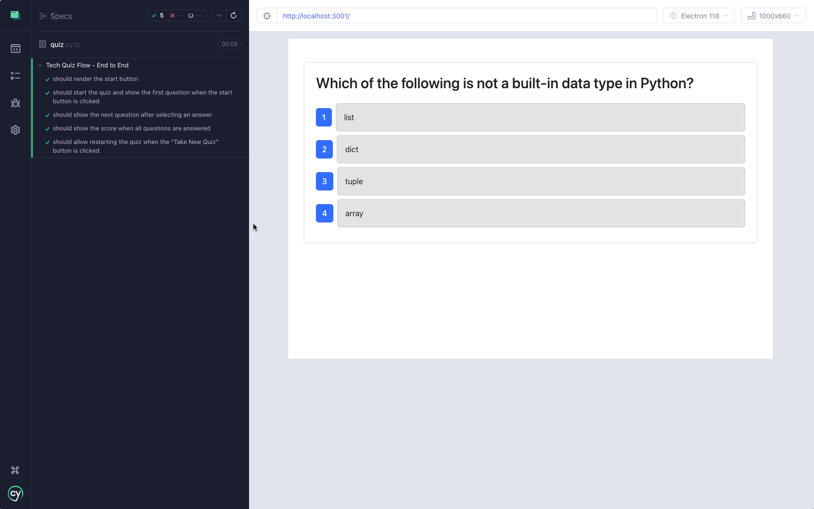
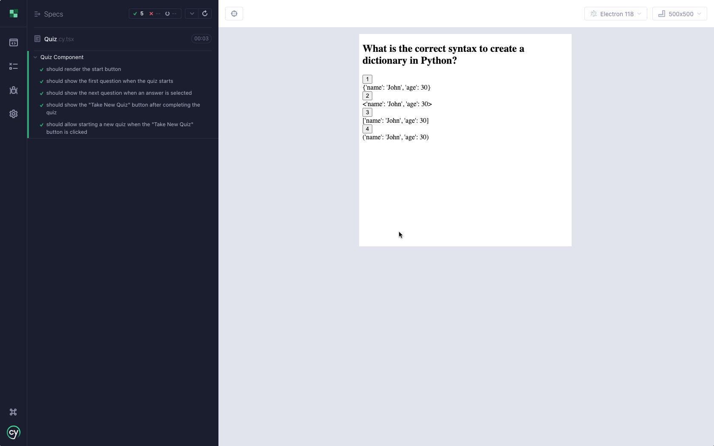
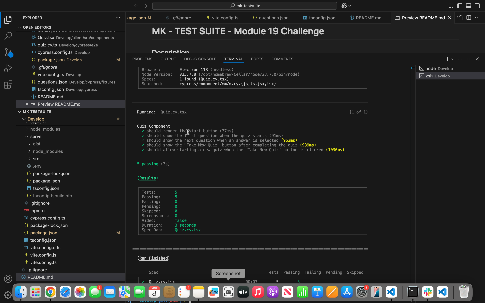

KoneTechI®  
  Feb, 2025
  
   
    
  # MK - TEST SUITE - Module 19 Challenge

  ## Description
  Enhance the given fully functioning Tech Quiz application by adding Cypress for both component and end-to-end tests.

  ## Table of Contents

  - [Installation](#installation)
  - [Usage](#usage)
  - [credits]()
  - [Contributing](#contributing)
  - [Tests](#tests)
  - [Video](#video)
  - [Screenshots](#screenshots)
  - [License](#license)
  - [Questions](#questions)

## Installation
1. Creeate a repository in GitHUB.
2. Clone to VSCode locally 
3. Unzip and upload starter Code 
4. Once all code is developed  in an integrated terminal execute following command to start the application
   - npm  i 
   - npm client build, npm server build 
   - npm run seed
   - npm run start:dev - to start the application 
   - npm run test - For command line testing 
   - npm run test-gui - For invoking Cypress and testing end to end and component testing 
 5. Perform testing 

## Usage
Perform End to End and Component testing using Cypress 

## Credits
Instructor and TA's

## Contributing
Test and provide feedbacks 

 ## Tests
Test using Cypress

## Video
video link:-

https://drive.google.com/file/d/1llJy2Lemayg-547Db4bx9Z-Kmve7CxpU/view?usp=drive_link

## Screenshots 
Test results screenshots below

## License
This project is licensed under the MIT license.

## Questions
For any questions, please contact me at [pmkonar@gmail.com](mailto:pmkonar@gmail.com).
You can also find more of my work at [muthukonar](https://github.com/muthukonar).

'This document was last updated on Feb, 2025'
